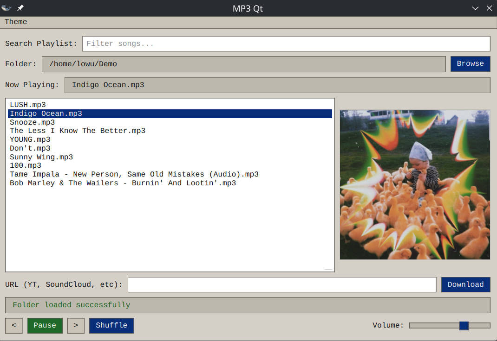
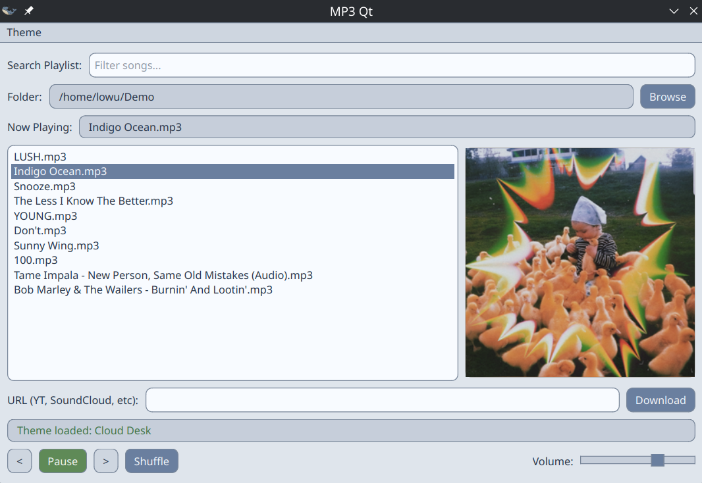
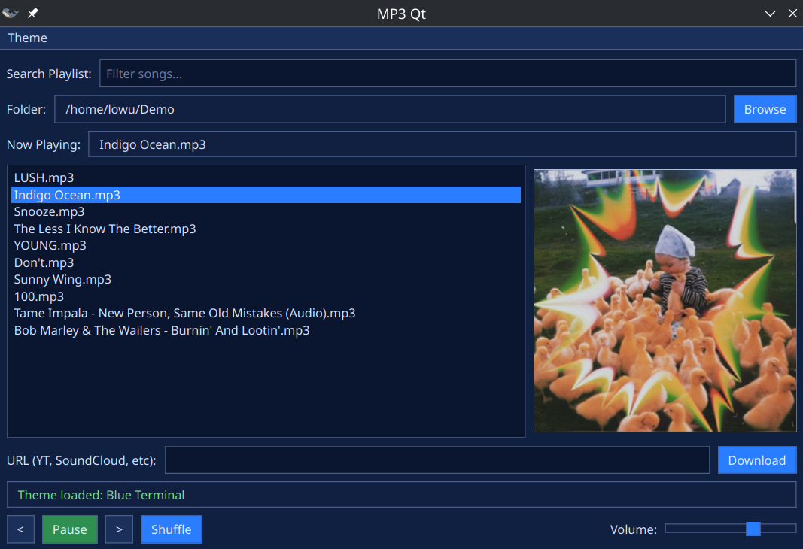
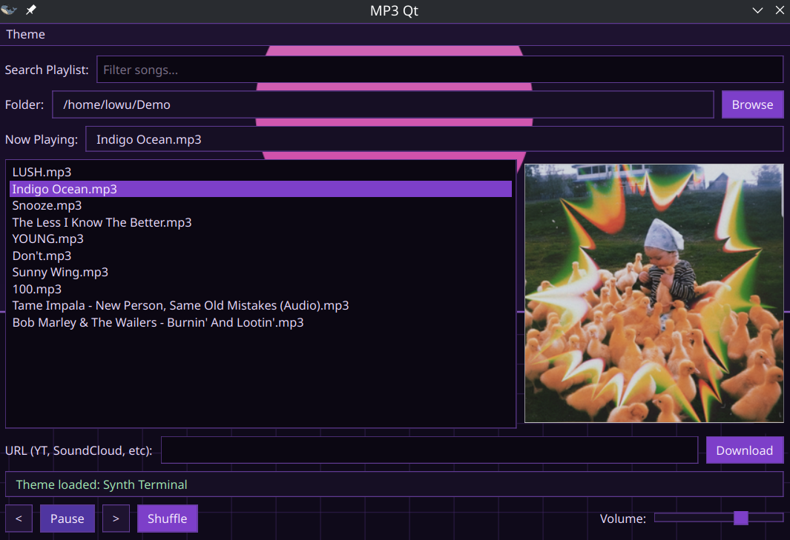

# mp3qt
this is a remake of an mp3 player i made using winforms

## FFmpeg
- The app uses `ffmpeg` from your system `PATH`
- If `ffmpeg` is missing, downloads that require conversion will fail and show an error.

## PyInstaller builds
- Linux: `pyinstaller app.spec`

## Linux desktop integration
After building the Linux bundle, install the desktop entry and icon:
- Install (user): `scripts/install.sh`
- Install (system): `scripts/install.sh --system`

## CLI usage
- Open with a folder: `mp3qt ~/Music`
- Set default folder (no UI): `mp3qt -d ~/Music`

## Screenshots

