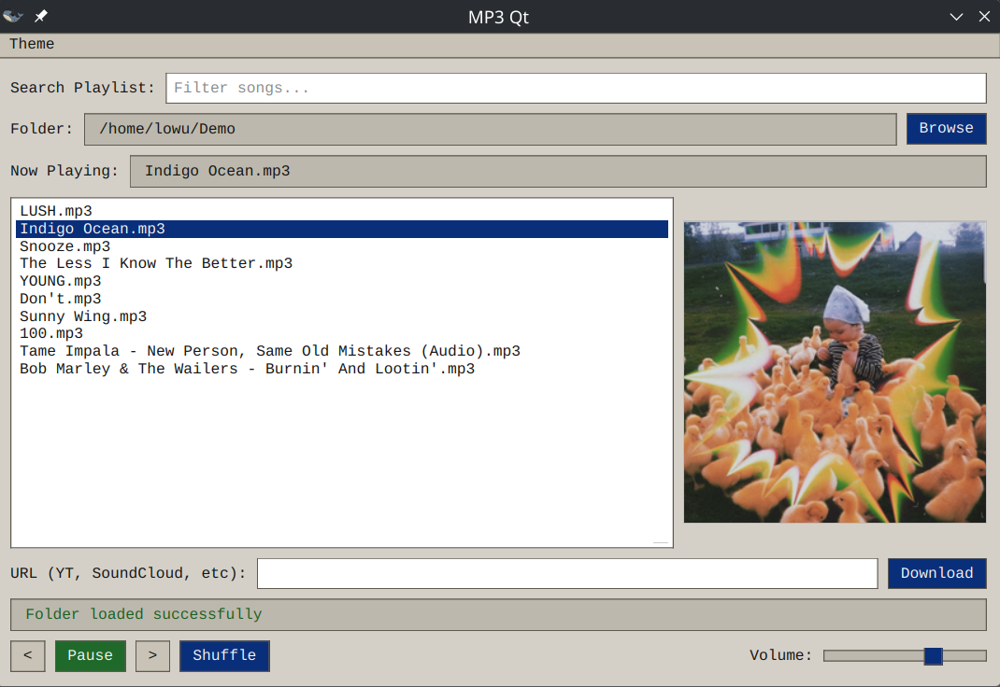
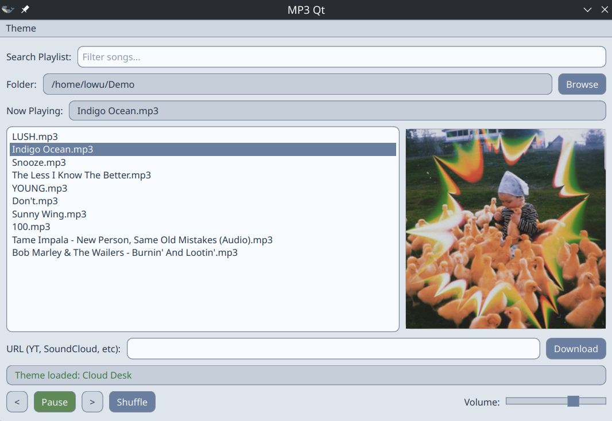
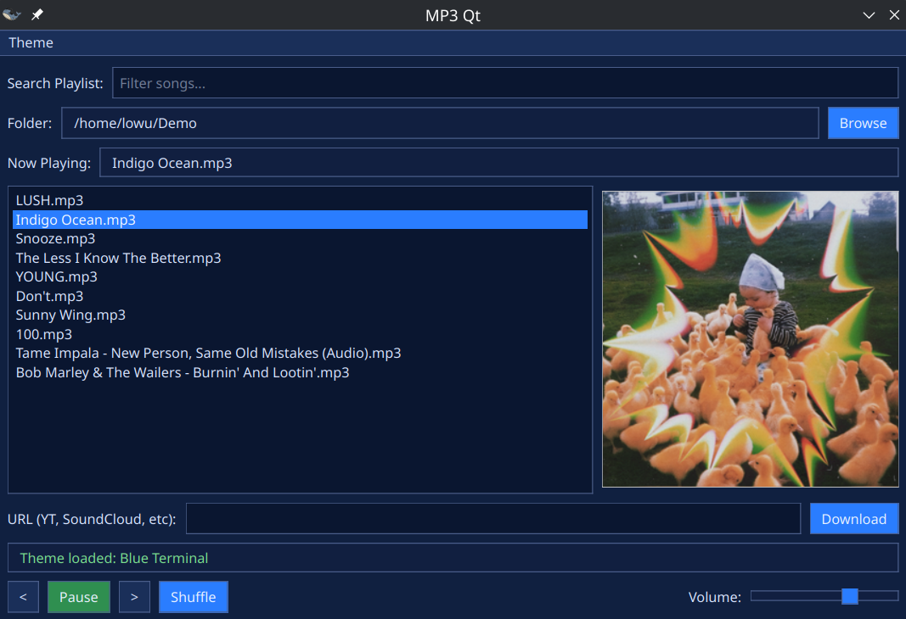
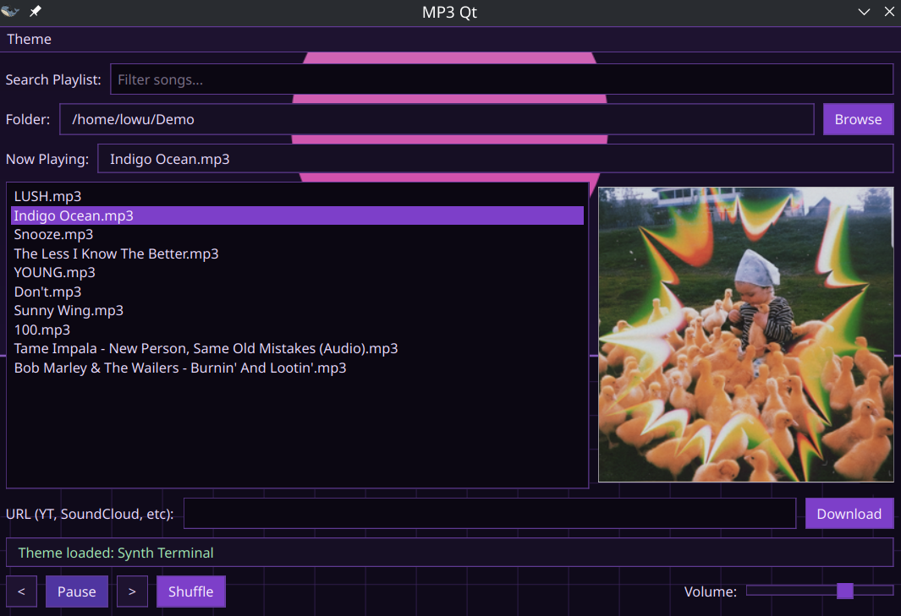

# mp3qt
This is a remake of an mp3 player I made using WinForms

## Linux installation
```bash
git clone git@github.com:lotanna-wu/mp3qt.git && cd mp3qt
python3 -m venv .venv
source .venv/bin/activate
pip install -r requirements.txt
./scripts/install.sh
```

## FFmpeg
- The app uses `ffmpeg` from your system `PATH`
- If `ffmpeg` is missing, downloads that require conversion will fail and show an error.

## PyInstaller builds
- `pyinstaller linux.spec`
- 'pyinstaller win.spec

## Linux desktop integration
`scripts/install.sh` builds the Linux bundle, installs the desktop entry and icon, and creates the `mp3qt` CLI launcher.
- Install: `./scripts/install.sh`
- Uninstall: `./scripts/uninstall.sh`

## CLI usage
- Open with a folder: `mp3qt ~/Music`
- Set default folder (no UI): `mp3qt -d ~/Music`

## Screenshots








